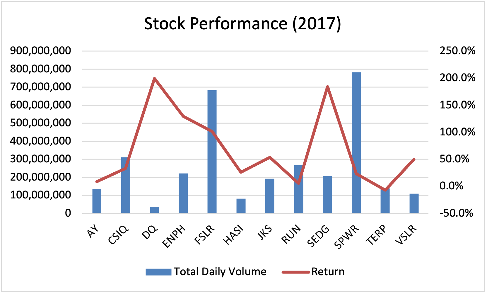
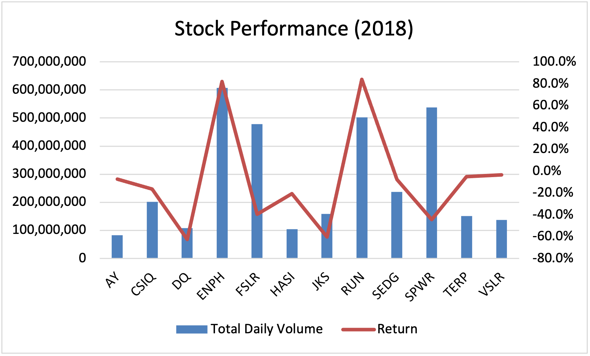
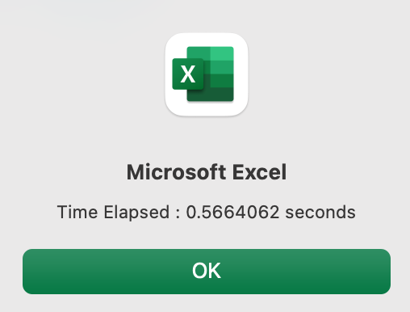
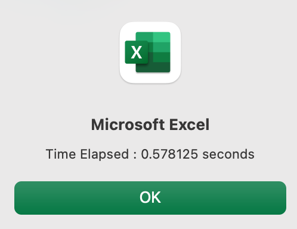
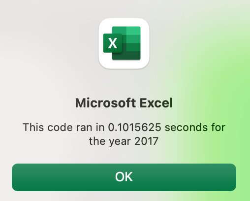
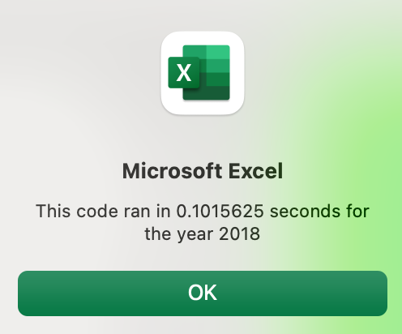

# Analysis of Green Stocks Using VBA

## Overview of Project

Our clients required assistance analyzing the performance of green energy stocks in 2017 and 2018. They had already decided to invest in DAQO New Energy Corp (DQ) and needed to know the quality of this stock specifically. Visual Basic Applications (VBA) was used to automate this task in Excel. However, the initial code showed inefficiencies due to the unnecessary use of a nested for-loop. When this code was refactored to a single for-loop, the code ran 5-6 times faster. As a result, the code can handle larger datasets without taking an impractical amount of time. 

## Results

As seen in the bar graphs, DQ stock experienced high returns in 2017 but low returns in 2018. As a result, it is uncertain how the stock will perform in following years. Moreover, the daily volume was relatively low in both years. Investor's Business Daily defines a stock with less than 400,000 shares per day as "thinly traded" [(1)](https://www.investors.com/how-to-invest/investors-corner/how-much-volume-should-a-stock-have/). Therefore, it is difficult to know the true value of the DQ stock, and the stock fails to show positive returns each year. Therefore, it is advised to avoid investing solely in DQ stock. A better investment would be in ENPH or RUN because these stocks had larger daily volumes than DQ and had positive returns for both 2017 and 2018. 

Below are the resulting times of the initial code for the years 2017 and 2018 (from left to right). A time of 0.5-0.6 seconds may seem sufficiently fast. However, if the code were to perform the analysis on a larger dataset, then the code may run too slowly. This is especially true considering that the initial code implemented a nested for-loop, which has a time-complexity of O(n^2), meaning the time increases by the square of the size of the dataset. 

Below are the resulting times for the refactored code for the years 2017 and 2018 (from left to right). The time has decreased from roughly 0.5 to 0.1 seconds. A change in 0.4 seconds may seem trivial, but this difference could be vital in a larger dataset. Since only single for-loops were implemented in this code, the time complexity is O(n), meaning the time increases linearly with the size of the dataset. As a result, adhering to single for-loops has significantly increased the efficiency and versatility of the code.

## Summary

### Challenges and Potential Improvements

When writing code involving the total volume index, the compiler would oftentimes throw an error stating that a value was "out of range". The index was restricted to the values 1 to 12, instead of 0 to 11, which explains the error. Like most languages, VBA begins an index at 0, meaning the 12th element in an array is in the 11th position. Attempting to index at the 12th position will therefore cause the compile to report an error. After this correction, the code ran smoothly with no issues.

Even once the code was working properly, the code repeatedly had to be refactored because indentions after if statements were forgotten. Indentions, though not technically necessary in VBA, give clarity to the writing, enabling other to quickly understand the meaning of the code. Overall, the issues creating the macro were minor, due to the simplicity of the algorithm. 

There are multiple areas where the macro could be improved. For one, table formatting could be added after the for-loop to give the results a cleaner, sharper appearance. Instead, the project allocated the formatting to a separate macro. Conditional formatting could be added to both the the volume and return columns so that the user can tell how different stocks compare. In addition, one could make a button that allows the user to sort the volume and return values in ascending or descending order. 

It would also be worth adding non-green energy stocks to the dataset to compare performance with the green energy stocks. It is likely that the non-green energy stocks would have much higher total daily volume because the oil and coal industries have remained vibrant despite their adverse effects on the environment.

### The Purpose of Refactoring

Refactoring enables programmers to improve both the readability and efficiency of code. When working with large amounts of data, the programmer must have an algorithm that will not slow down too much when the dataset increases in size. Nested for-loops, despite their versatility, will eventually lag significantly behind a small group of single for-loops, so even beginners in data analysis need to be mindful of the efficiency of their algorithms. Refactoring also provides the opportunity to add comments that further explain the meaning of code. However, like writing an essay, one can always find something that could be refactored, so one has to learn when to allow oneself to move on to the next project. 

If one does refactor, it is possible that initial alterations to the code could backfire and cause new problems. Due to these risks, programmers should always save their original code somewhere, hence why so many programmers use GitHub to keep track of the changes in their projects. 

### Final Thoughts

The return in DQ stock went from 200% in 2017 to -60% in 2018. This fluctuation in returns suggests that investing solely in DQ would place our clients in high financial risk. In addition, the daily trading volume for DQ is low, meaning it may be hard to liquidate even if the stock performs well              [(2)](https://corporatefinanceinstitute.com/resources/knowledge/trading-investing/average-daily-trading-volume-adtv/). However, it is advised that the clients not only invest in higher-performing stocks such as ENPH and RUN but also invest in less viable stocks, like DQ, in order to maintain a diverse portfolio that spreads out the risk of investment. 

